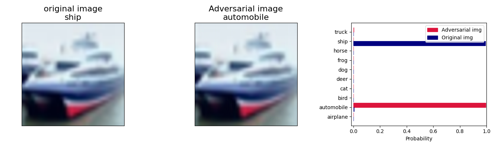

# CLIP_adv

针对 OpenAI [CLIP](https://github.com/openai/CLIP) 的定向对抗攻击演示。脚本在 CIFAR-10 上选取一张图片，用基于梯度的方法（交叉熵 + 梯度下降）将 CLIP 的分类结果迫近到指定目标类别，并把每一步的扰动可视化保存到 `result/`。

## 目录结构

```
CLIP_adv/
├── CLIP/           # OpenAI CLIP 源码，作为 git submodule 引入
├── CLIP_adv.py     # 对抗攻击主脚本
├── result/         # 迭代过程与最终结果可视化
└── README.md
```

## 环境要求

- Python ≥ 3.8
- PyTorch（建议 CUDA 版本，CPU 也可运行但很慢）
- `ftfy`, `regex`, `tqdm`, `matplotlib`, `numpy`, `torchvision`

## 克隆与初始化

由于 `CLIP/` 是子模块，克隆时需要带上 `--recursive`：

```bash
git clone --recursive https://github.com/<your-name>/CLIP_adv.git
cd CLIP_adv
```

如果已经克隆但忘了 `--recursive`，可以补拉子模块：

```bash
git submodule update --init --recursive
```

更新子模块到上游最新提交：

```bash
git submodule update --remote CLIP
```

## 安装依赖

```bash
pip install torch torchvision ftfy regex tqdm matplotlib numpy
pip install -e ./CLIP        # 安装子模块中的 CLIP 包
```

## 运行

```bash
python CLIP_adv.py
```

首次运行会自动下载 CIFAR-10 数据集和 CLIP `ViT-B/32` 权重。

### 可调参数（位于 `CLIP_adv.py` 顶部 / 中部）

| 参数 | 含义 | 默认值 |
| --- | --- | --- |
| `dataset_choice` | 数据集名称 | `"CIFAR10"` |
| `target_label` | 攻击目标类别索引（0–9） | `1` (automobile) |
| `LR` | 梯度更新步长 | `0.5` |
| `steps` | 迭代轮数 | `30` |

被攻击图像默认取自 `test_data[1]`，可按需替换索引。

## 输出

- `result/adv_{step}.png` —— 每 5 步保存一次的 [原图 | 当前对抗样本 | 扰动可视化] 三连图
- `result/result.png` —— 最终对比图：原图预测 vs. 对抗样本预测 vs. 类别概率分布柱状图

## 效果示例



## 许可

本仓库脚本仅用于学习与研究。子模块 `CLIP/` 的版权与许可遵循 OpenAI/CLIP 仓库的 [LICENSE](https://github.com/openai/CLIP/blob/main/LICENSE)。
